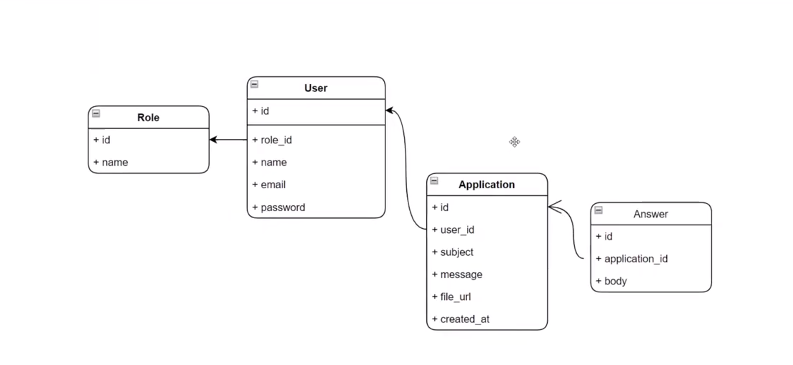

## audio to text

____
    php artisan stub:publish
____
    php artisan make:mail ApplicationCreated
____
    php artisan queue:listen
## Setup
    cp .env.example .env
___
    composer install
___
    npm install
___
    php artisan key:generate
___
    php artisan migrate:fresh --seed
___
    php artisan storage:link
___
    npm run dev
___
    php atisan queue:work
___
    MAIL_MAILER=log